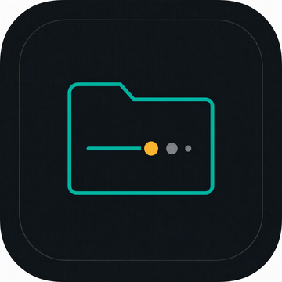

<!-- markdownlint-disable MD033 MD041 -->

<div align="center">
  
  <h1>Bye.DS_Store</h1>
  <p><strong>Halte deine Mac-Ordner automatisch frei von <code>.DS_Store</code></strong></p>
  <p>Ein kostenloses, natives Open-Source-Menüleistenprogramm für macOS. Arbeite einfach in Finder weiter, während es im Hintergrund aufräumt.</p>
  <p>
    <a href="https://github.com/yororoA/Bye.DS_Store/releases/latest"></a>
    
    
    <a href="LICENSE"></a>
  </p>
  <p>
    <a href="https://github.com/yororoA/Bye.DS_Store/releases/latest"><strong>Neueste Universal-DMG (Apple Silicon & Intel) herunterladen</strong></a>
    ·
    <a href="https://bye-dsstore.yororoice.top/">Produktseite</a>
    ·
    <a href="https://github.com/yororoA/Bye.DS_Store">Quellcode</a>
  </p>
  <p>
    <a href="README.md">简体中文</a> ·
    <a href="README.zh-Hant.md">繁體中文</a> ·
    <a href="README.en.md">English</a> ·
    <a href="README.ja.md">日本語</a> ·
    <strong>Deutsch</strong> ·
    <a href="README.ru.md">Русский</a>
  </p>
</div>

---

**Gebaut für:**

- Git, Xcode, VS Code, Unity, Webprojekte, NAS-Ordner und externe SSDs, in denen `.DS_Store` immer wieder auftaucht;
- automatische Bereinigung ohne Dock-App und ohne riskantes `find / -delete`;
- Entwickler, die ein natives Swift-Tool mit sichtbaren Scan-Grenzen, Fehlerpfaden und klaren Berechtigungen möchten.

## Auf einen Blick

| Frage | Bye.DS_Store |
| --- | --- |
| Stört es meinen Workflow? | Es bleibt in der Menüleiste und folgt Finder unauffällig |
| Kann es falsche Dateien löschen? | Hintergrundbereinigung bleibt bei Finder; Gesamtscans brauchen Bestätigung |
| Kann ich den Bereich steuern? | Elternordner, Datenträger, Ausschlüsse und symbolische Links sind konfigurierbar |
| Kann ich das Ergebnis prüfen? | Gescannte, entfernte und fehlgeschlagene Elemente samt Pfaden werden angezeigt |

## Kernfunktionen

| Funktion | Beschreibung |
| --- | --- |
| Finder-Überwachung | Liest aktuelle Finder-Fenster und führt mehrere Fenster automatisch zusammen |
| Bereinigung mit Schonfrist | Behält geschlossene Ordner standardmäßig 60 Sekunden im Bereich |
| Bereinigungsbereich | Überwachter Ordner plus direkter Elternordner; optional nur der aktuelle Ordner |
| Gesamtscan | Startvolume, externe Datenträger, Netzwerkdatenträger oder alle eingebundenen Volumes manuell scannen |
| Ausschlüsse | Ordner nach Namen oder Pfad ausschließen, etwa `node_modules` oder `lib/packages` |
| Sicherheitsgrenzen | Vorher bestätigen, währenddessen stoppen und fehlgeschlagene Pfade danach prüfen |
| Menüleisten-App | Kein Dock-Symbol, globaler Kurzbefehl `⌘⌥B` |
| Automatische Updates | Prüft standardmäßig täglich nach einem neuen Release; in den Einstellungen abschaltbar oder manuell startbar |
| Sprachen | Systemerkennung oder 简体中文, 繁體中文, English, 日本語, Deutsch und Русский |

## Warum den Elternordner einbeziehen?

Tests unter macOS haben gezeigt, dass `.DS_Store` beim Öffnen eines Unterordners häufig im ursprünglichen Ordner geschrieben wird und nicht direkt im geöffneten Ordner. Der Standardbereich umfasst daher:

1. Den aktuell über Finder überwachten Ordner
2. Seinen direkten Elternordner

Die App geht nicht weiter nach oben und durchsucht Unterordner nicht automatisch rekursiv.

## Gesamtscan und Sicherheit

Der Gesamtscan ist eine ausdrücklich gestartete, manuelle Aktion und gehört nicht zur Hintergrundabfrage.

- Symbolische Links werden übersprungen, damit keine zweite Verzeichnisstruktur betreten wird;
- konfigurierte Ausschlüsse und ihre Unterordner werden übersprungen;
- gescannte Elemente, gefundene Dateien, entfernte Dateien und Fehler werden gezählt;
- geschützte oder nicht zugängliche Orte werden protokolliert, ohne den gesamten Scan abzubrechen.

Für manche Systemordner ist **vollständiger Festplattenzugriff** in den macOS-Einstellungen für Datenschutz & Sicherheit erforderlich.

## Ausschlussregeln

Gib in den Einstellungen einen Ordnernamen oder einen Eltern-/Zielpfad ein und drücke Return:

```text
node_modules
lib/packages
```

Jede Regel wird zu einem entfernbaren Tag. Die Standardliste enthält typische Abhängigkeits- und Build-Ordner:

```text
node_modules, .venv, venv, __pycache__, vendor, Pods, target, .gradle
```

## Voraussetzungen

- macOS 14 oder neuer
- Xcode 16 oder neuer
- Swift-6-Toolchain

## Lokal ausführen

```bash
./scripts/run-app.sh
```

Nur bauen:

```bash
./scripts/build-app.sh
```

Tests ausführen:

```bash
swift test --disable-index-store
```

Die gebaute App liegt unter `dist/Bye.DS_Store.app`.

## Berechtigungen beim ersten Start

Beim ersten Start fragt macOS, ob Bye.DS_Store Finder steuern darf. Diese Berechtigung wird nur zum Lesen der aktuellen Finder-Ordner verwendet.

Wenn der Zugriff zuvor abgelehnt wurde:

```text
Systemeinstellungen > Datenschutz & Sicherheit > Automation > Bye.DS_Store > Finder
```

Für geschützte Orte wie Schreibtisch, Dokumente oder Downloads kann zusätzlich eine Dateizugriffsberechtigung erforderlich sein.

## Releases und GitHub Actions

Release Please nutzt Conventional Commits, um automatisch einen Release-PR gegen `main` zu erstellen. Beim Mergen werden `CHANGELOG.md` aktualisiert, ein `vX.Y.Z`-Tag und der GitHub Release erstellt; anschließend paketiert der bestehende macOS-Build-Workflow die markierte Version.

Ein Versions-Tag löst die automatische Veröffentlichung aus:

```bash
git tag vX.Y.Z
git push origin vX.Y.Z
```

Der Workflow führt Tests aus, baut die macOS-App, erstellt zip/DMG und SHA-256-Prüfsummen und verwendet Developer-ID-Signierung sowie Notarisierung, wenn Apple-Developer-Secrets hinterlegt sind.

Release-Beschreibungen liegen unter:

```text
.github/release-notes/<tag>.md
```

Die Produktseite wird über GitHub Pages unter [bye-dsstore.yororoice.top](https://bye-dsstore.yororoice.top/) veröffentlicht. Der Pages-Workflow liest beim Deployment den neuesten Release und aktualisiert Version sowie DMG-URL automatisch.

## Lizenz

Dieses Projekt steht unter der [MIT License](LICENSE).

## Projektstruktur

```text
Sources/SweeperCore/       Ordnerstatus, Bereinigungsbereich und Löschlogik
Sources/DSStoreSweeper/    Finder-Integration, Menüleisten-UI, Einstellungen, Lebenszyklus
Tests/SweeperCoreTests/    Tests für das Kernverhalten
Support/Info.plist         Metadaten des macOS-App-Bundles
scripts/                   Build- und Startskripte
site/                      GitHub-Pages-Produktseite
.github/workflows/         Release- und Pages-Automation
```
